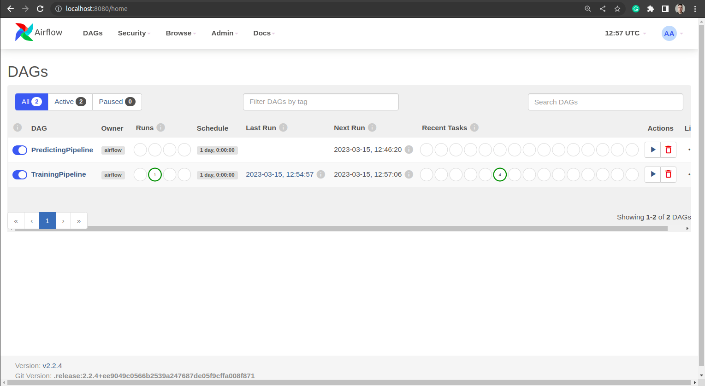
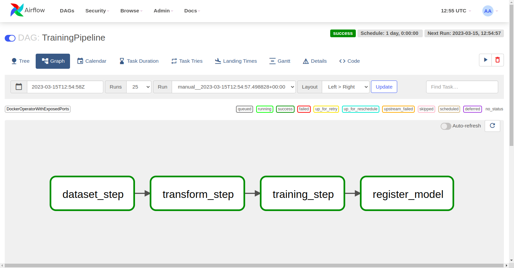
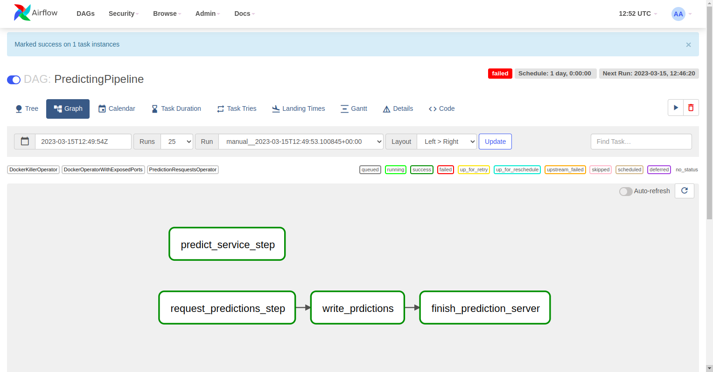

# MLOps Airflow

This project is a code example of a Machine Learning project sctructured to build and deployed in a container-oriented architecture over Apache Airflow.

## 1 - Project Structure

```
.
├── airflow
│   ├── dags
│   │   ├── __init__.py
│   │   ├── predict_pipeline.py
│   │   └── train_pipeline.py
│   ├── docker-compose.yaml
│   ├── __init__.py
│   ├── logs
│   └── plugins
│       ├── __init__.py
│       └── operators
│           ├── docker_killer_operator.py
│           ├── docker_operator_with_exposed_ports.py
│           ├── __init__.py
│           └── prediction_resquests_operator.py
├── bucket
│   ├── data
│   │   ├── iris.csv
│   │   ├── iris_predict.csv
│   │   ├── test_iris.csv
│   │   └── train_iris.csv
│   ├── model
│   │   ├── 2023-03-13T23:22:49.474676+00:00_model.pkl
│   │   └── model.pkl
│   └── response.txt
├── ml_project
│   ├── cicd
│   │   ├── build_push.yml
│   │   └── code_test.yml
│   ├── Dockerfile
│   ├── predict.sh
│   ├── requirements.txt
│   ├── src
│   │   ├── app
│   │   ├── model
│   │   │   ├── custom_model.py
│   │   │   └── __init__.py
│   │   ├── predict.py
│   │   ├── train.py
│   │   └── transform.py
│   ├── test
│   │   ├── conftest.py
│   │   ├── data
│   │   │   ├── test_data.csv
│   │   │   └── test_model.pkl
│   │   ├── test_custom_model.py
│   │   ├── test_predict.py
│   │   ├── test_train.py
│   │   └── test_transform.py
│   ├── train.sh
│   └── transform.sh
├── Makefile
└── README.md

```

## 2 - Run the application


#### 2.1 - Build ML proyect

Before running the DAGs in Airflow with the ML pipelines, you have to build the docker image with the ML code, for doing so, you can run the following command

```sh
mlops_airflow$ make build
```

This will create a docker image called "ml_project"

#### 2.2 - Run ML project tests

To check that everything is ok, you can run the code test

```sh
mlops_airflow$ make test
```

#### 2.3 - Run Airflow

First of all you have to load Airflow with docker-compose. Before running the container, you have to set the absolute path of the project in your host machine in the file 

```sh
PROJECT_DIR=/home/adelgado/Documents/mentoring_mlops_airflow
```

Afterwards, airflow can be run by executing the command

```sh
mlops_airflow$ make airflow_up
```

#### 2.4 Run DAGs

To open the Airflow interface with the following url "http://localhost:8080/" (user: airflow pass: airflow) 


### ML Pipelines



#### TrainPipeline



#### PredictPipeline


